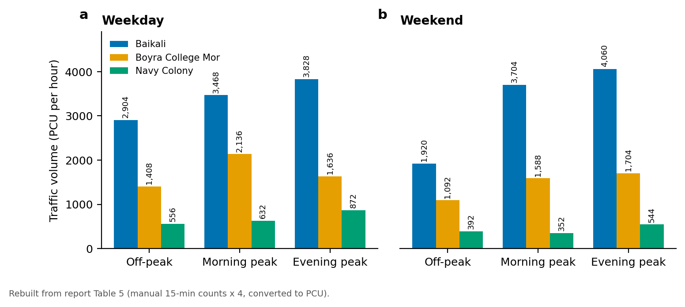
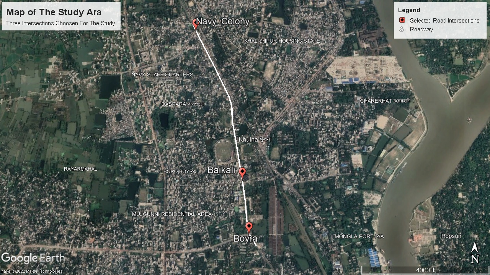
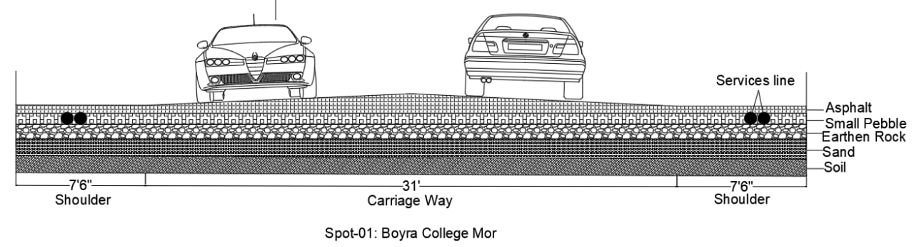
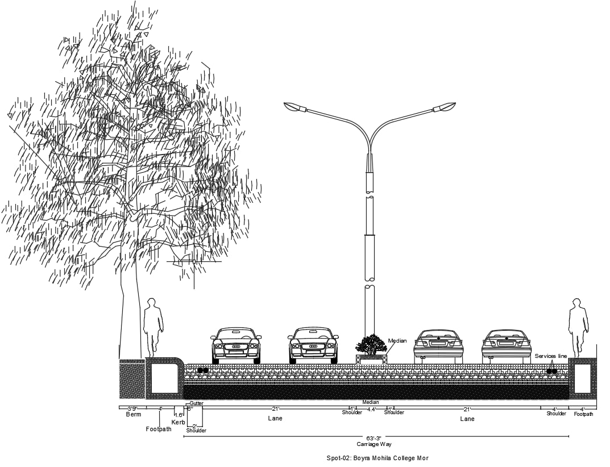
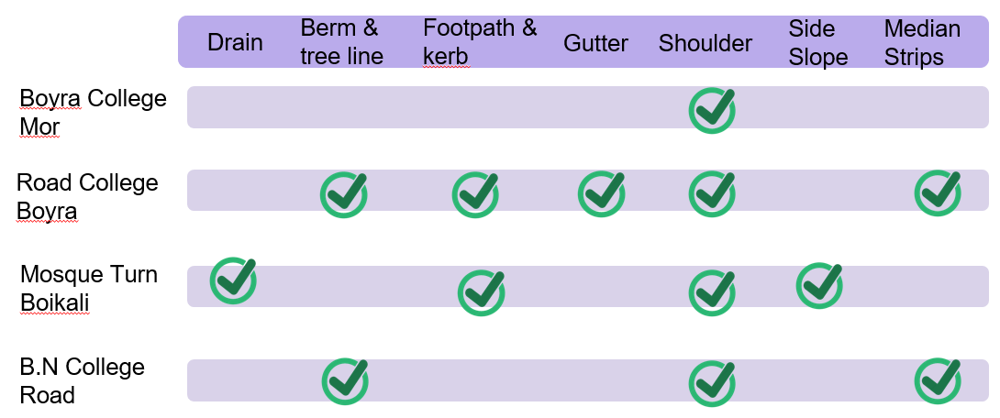
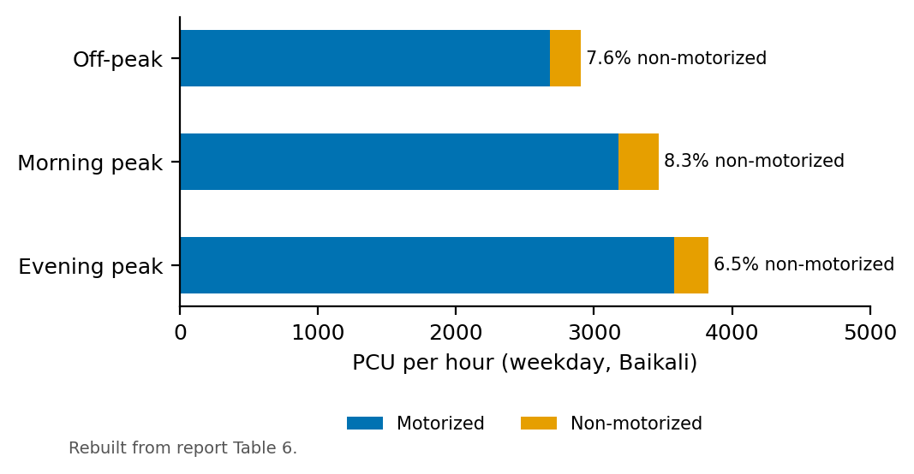

# Road Cross-Section and Traffic Survey: Notun Rasta to Boyra, Khulna

**URP 3232 Transportation Planning Studio, Dept. of Urban and Regional Planning, KUET** · 

## Summary

We surveyed the 3.9 km road corridor from Notun Rasta to Boyra in Khulna to assess its physical condition and traffic load. We measured and drew cross-sections at four points and compared their elements with standard road design. We then ran traffic volume, headway, spot-speed and moving-observer surveys at three intersections at off-peak, morning-peak and evening-peak hours, on both weekdays and weekends. **Baikali** on the highway carries the heaviest traffic, peaking at **4,060 PCU/h** on weekend evenings. Its weekday morning-peak volume (3,468 PCU/h) is about 1.6 times Boyra College Mor's and 5.5 times Navy Colony's. The moving-observer survey measured a flow of **1,889 PCU/h** along the corridor.



## Study area

The road corridor from Notun Rasta to Boyra, Khulna, with survey intersections at Goalkhali Navy Colony, Baikali and Boyra College Mor.



## Data (primary field survey)

| Survey | What was recorded |
|---|---|
| Cross-sectional elements | Tape-measured carriageway, shoulder, footpath, kerb, drain, berm, median at 4 locations, compared with standard widths for road classes |
| Traffic volume | Manual 15-minute classified counts (bike, cycle, rickshaw, van, auto, CNG, car, covered van, bus, truck), multiplied by 4 and converted to PCU |
| Headway and spot speed | Stopwatch timing over a 100 m section |
| Moving observer | Survey vehicle over 3.9 km, counting overtaking, overtaken and opposing vehicles |

Each intersection was surveyed 6 times: off-peak, morning peak and evening peak, on weekdays and on weekends.

## Method

1. Carried out a reconnaissance survey, chose 4 cross-section locations and then 3 traffic intersections.
2. Drew each cross-section and checked 7 elements (drain, berm and tree line, footpath and kerb, gutter, shoulder, side slope, median).
3. Converted classified counts to passenger car units (PCU): car 1, motorcycle 0.75, bicycle 0.5, bus/truck 3.
4. Compared intensity across intersections, periods and days, and split motorized from non-motorized traffic.
5. Estimated corridor flow with the moving-observer formula q = (m_w + m_a) / (t_w + t_a).

## Results

- **Cross-sections:** in the comparative checklist, all four sections have a shoulder, but most lack several standard elements. College Road (Boyra) is the most complete (berm, footpath and kerb, gutter, shoulder, median). Boyra College Mor has only a shoulder marked.
- **Intensity:** Baikali is the busiest intersection in every period. Weekday traffic ranges from 2,904 to 3,828 PCU/h there, against 556–872 PCU/h at Navy Colony.
- **Mode split at Baikali (weekday):** non-motorized vehicles account for only 6.5–8.3% of PCU.
- **Corridor flow (moving observer):** 1,889 PCU/h, from 400 overtaking vehicles, 67 overtaken vehicles and 207 opposing vehicles at a survey speed of 27 km/h.
- Spot-speed and headway surveys gave an average speed of 27.2 km/h and a mean headway of 5.6 s.

| Boyra College Mor | College Road, Boyra |
|---|---|
|  |  |





## Tools

Measuring tape, stopwatch and field forms · Google Earth (location maps) · Cross-section drawings · Microsoft Excel · Python/matplotlib (redrawn charts in [`viz/`](viz/))

## Repository contents

```
images/   original map, cross-section drawings and checklist (unchanged) + redrawn charts
viz/      make_figures.py and data/*.csv (Tables 5 and 6 from the report)
```

## Contact

Chinmoy Ghosh Shuvo · Open to collaboration and knowledge sharing. Feel free to reach out on [LinkedIn](https://www.linkedin.com/in/chinmoyghosh034).
